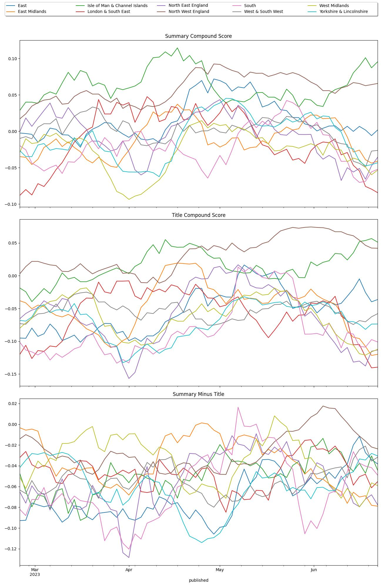

# bbc-sentiment

> relies on [datazimmer](https://github.com/sscu-budapest/datazimmer) and the [tooling](https://sscu-budapest.github.io/tooling) of sscub

## Sentiment score of BBC articles published related to different regions of England

Based on titles and summaries of articles, like [these](./reports/complete/latest.md)

